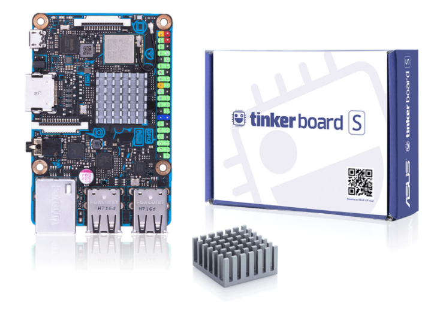
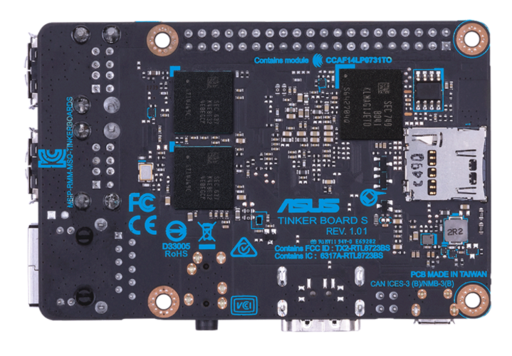
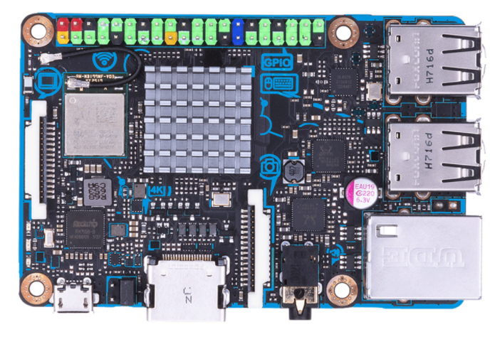
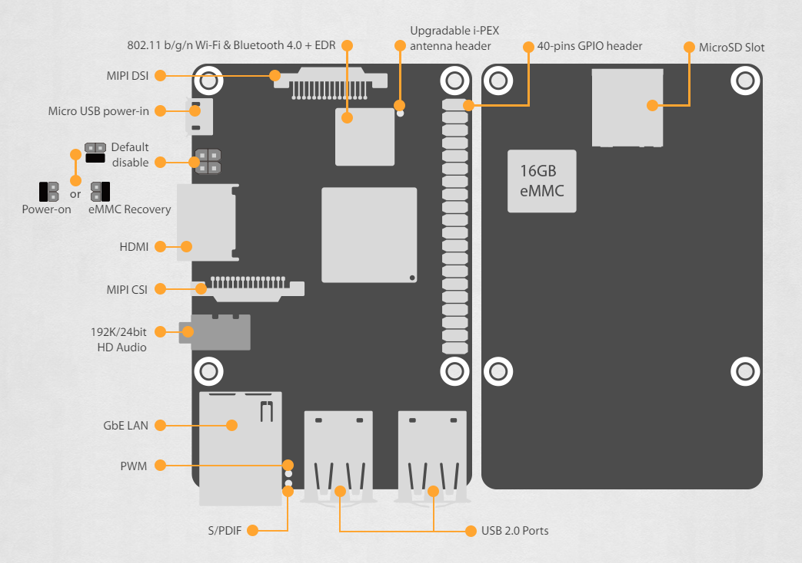
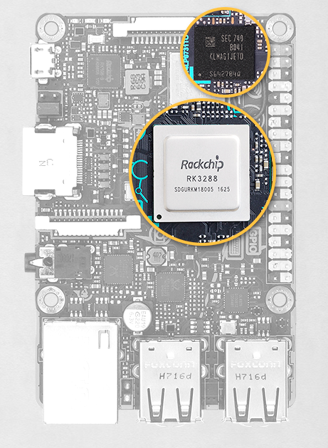
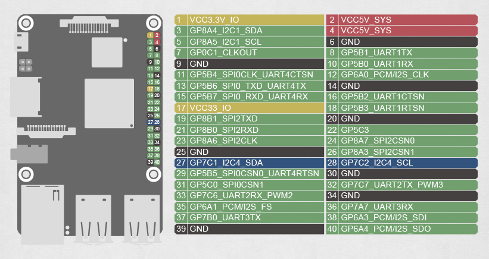
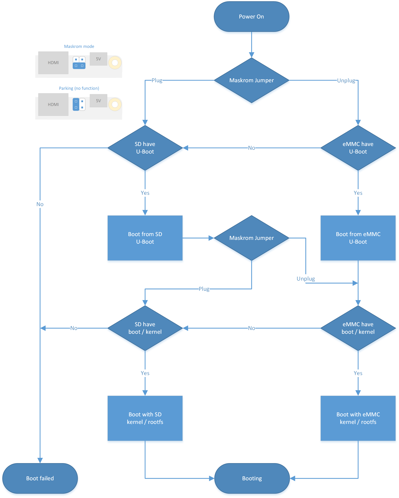

# rk3288 开发板学习

```
感谢Jack赠送开发板~
```

## 本仓库内容

1. Thinker Board S 开发板学习


```
Something I hope you know before go into the coding ~
First, please watch or star this repo, I'll be more happy if you follow me.
Bug report, questions and discussion are welcome, you can post an issue or pull a request.
```

## 相关站点

* 官网: <https://www.asus.com/networking-iot-servers/aiot-industrial-solution/tinker-board-series/tinker-board-s/>
* 启动顺序流程图: <https://tinkerboarding.co.uk/others/SBF/>

---

## 目录

* [读我](README.md)
* [快速上手](docs/快速上手.md)
* [Android系统](docs/Android系统.md)
    * [编译完整Android系统](docs/Android系统/编译完整Android系统.md)
* [Linux系统](docs/Linux系统.md)
    * [官方Debian系统](docs/Linux系统/官方Debian系统.md)
    * [构造完整Linux系统](docs/Linux系统/构造完整Linux系统.md)


## 经典图示
















---
