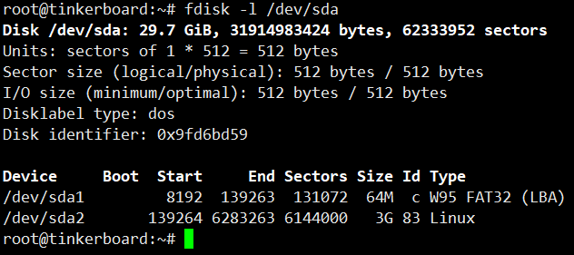
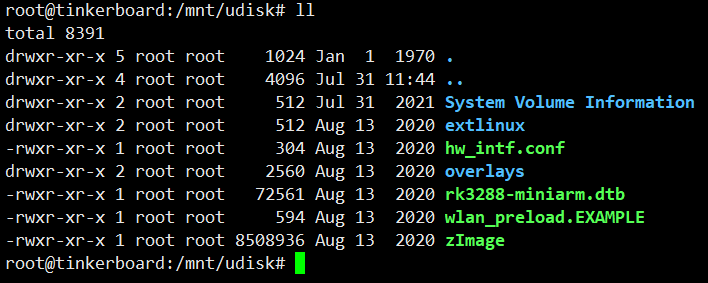
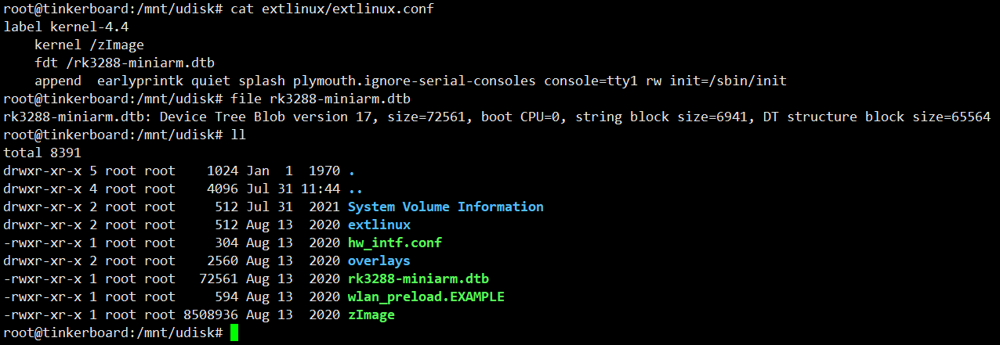
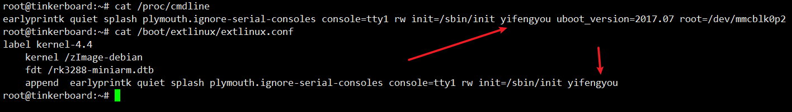
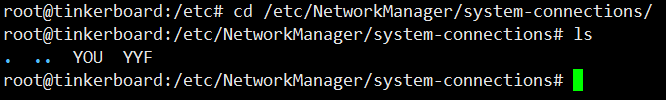

<!-- MDTOC maxdepth:6 firsth1:1 numbering:0 flatten:0 bullets:1 updateOnSave:1 -->

- [官方Debian系统](#官方debian系统)   
   - [烧写镜像](#烧写镜像)   
   - [启动菜单](#启动菜单)   
   - [获取内核信息](#获取内核信息)   
   - [网络配置](#网络配置)   

<!-- /MDTOC -->
# 官方Debian系统


## 烧写镜像


烧写镜像其实是要重新分区，分了两个区，一个是FAT32，另一个是linux专属的ext4分区

* uboot阶段去FAT32分区读取必要内容，以及内核
* ext4作为根文件系统



其中FAT32分区内容如下：




类似的树莓派的FAT32分区内容大致包括下列内容：

```
An overview of the files on the /boot/firmware partition (the 1st partition
on the SD card) used by the Ubuntu boot process (roughly in order) is as
follows:

* bootcode.bin   - this is the second stage bootloader loaded by all pis with
                   the exception of the pi4 (where this is replaced by flash
                   memory)
* config.txt     - the first configuration file read by the boot process
* syscfg.txt     - the file in which system modified configuration will be
                   placed, included by config.txt
* usercfg.txt    - the file in which user modified configuration should be
                   placed, included by config.txt
* start*.elf     - the third stage bootloader, which handles device-tree
                   modification and which loads...
* uboot*.bin     - various u-boot binaries for different pi platforms; these
                   are launched as the "kernel" by config.txt
* boot.scr       - the boot script executed by uboot*.bin which in turn
                   loads...
* vmlinuz        - the Linux kernel, executed by boot.scr
* initrd.img     - the initramfs, executed by boot.scr
* meta-data      - meta-data for cloud-init; usually just contains the
                   instance id
* network-config - network configuration for cloud-init; edit this to set up
                   wifi access points and other networking settings
* user-data      - user-data for cloud-init; edit this to configure initial
                   users, SSH keys, packages, etc.
```


## 启动菜单(内核参数)



FAT32分区中，extlinux/extlinux.conf 为启动菜单

```
root@tinkerboard:/mnt/udisk# cat extlinux/extlinux.conf
label kernel-4.4
    kernel /zImage
    fdt /rk3288-miniarm.dtb
    append  earlyprintk quiet splash plymouth.ignore-serial-consoles console=tty1 rw init=/sbin/init
```



## 获取内核信息

```
# file zImage
zImage: Linux kernel ARM boot executable zImage (little-endian)
```

```
root@tinkerboard:/mnt/udisk# binwalk zImage

DECIMAL       HEXADECIMAL     DESCRIPTION
--------------------------------------------------------------------------------
36            0x24            Linux kernel ARM boot executable zImage (little-endian), load address: "0x00000000", end address: "0x0081D608"
26604         0x67EC          gzip compressed data, maximum compression, from Unix, NULL date (1970-01-01 00:00:00)
```

提取gzip数据：

```
# dd if=zImage of=gzipKernel bs=1 skip=26604
# file gzipKernel
gzipKernel: gzip compressed data, max compression, from Unix
```

获取内核版本：

```
root@tinkerboard:~/kernel# uname -a
Linux tinkerboard 4.4.132+ #8 SMP Thu Aug 13 08:51:08 UTC 2020 armv7l GNU/Linux

root@tinkerboard:~/kernel# zcat gzipKernel |strings |grep "Linux version"
Linux version 4.4.132+ (leslie_yu@tinkerboard) (gcc version 5.4.0 20160609 (Ubuntu/Linaro 5.4.0-6ubuntu1~16.04.9) ) #8 SMP Thu Aug 13 08:51:08 UTC 2020
```


## 网络配置

```
# cat wlan_preload.EXAMPLE
##############################################################
# Tinker-net-mods service allow user preload network
# configuration without monitor.
#
# 1. Create a folder named system-connections.
#
# 2. Modify this example keyfile to match your wireless
#    environment or copy any existent keyfiles. Then put them
#    into system-connections directory.
#
# 3. Network manager will load keyfile after boot up.
#
##############################################################
[connection]
id=ASUS_Preload_Keyfile

[wifi]
ssid=MyAccessPoint

[wifi-security]
key-mgmt=wpa-psk
psk=MyPassPhrase
```

system-connections需要NetworkManager去读取，貌似没有规则去/boot分区读取吧




```
[connection]
id=YOU
uuid=e8262ff1-55eb-4dc1-a4e8-16dc5a83bfe8
type=wifi
permissions=user:linaro:;

[wifi]
mac-address=80:C5:F2:46:DE:EB
mac-address-blacklist=
mode=infrastructure
ssid=YOU

[wifi-security]
auth-alg=open
key-mgmt=wpa-psk
psk=YOURFUNYPASSWD

[ipv4]
dns-search=
method=auto

[ipv6]
addr-gen-mode=stable-privacy
dns-search=
method=auto
```


---
