<!-- MDTOC maxdepth:6 firsth1:1 numbering:0 flatten:0 bullets:1 updateOnSave:1 -->

- [官方linux内核编译](#官方linux内核编译)   
   - [源码获取](#源码获取)   
   - [安装编译依赖环境](#安装编译依赖环境)   
   - [获取内核配置文件](#获取内核配置文件)   
   - [配置并编译](#配置并编译)   
   - [安装](#安装)   
   - [参考](#参考)   

<!-- /MDTOC -->
# 官方linux内核编译

## 源码获取

```
git clone https://github.com/TinkerBoard/debian_kernel

国内建议使用镜像加速：

git clone https://hub.fastgit.org/TinkerBoard/debian_kernel
```

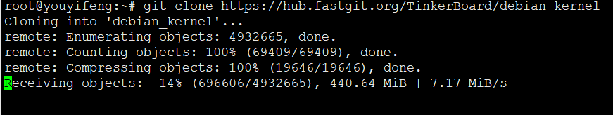

```
root@youyifeng:~# git clone https://hub.fastgit.org/TinkerBoard/debian_kernel
Cloning into 'debian_kernel'...
remote: Enumerating objects: 4932665, done.
remote: Counting objects: 100% (69409/69409), done.
remote: Compressing objects: 100% (19646/19646), done.
remote: Total 4932665 (delta 51576), reused 62046 (delta 49716), pack-reused 4863256
Receiving objects: 100% (4932665/4932665), 1.17 GiB | 6.83 MiB/s, done.
Resolving deltas: 100% (4053999/4053999), done.
Checking out files: 100% (64038/64038), done.
```

吐槽：

分支能不能命名规范一下，搞这么多分支有什么屁用嘞~~~
有些狗屁分支还不一定能编译通过，浪费时间，上去就是一顿MMP

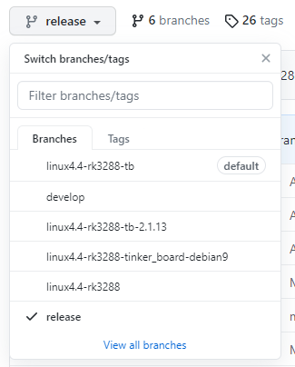


## 安装编译依赖环境

```
sudo apt-get install -y build-essential \
  lzop libncurses5-dev libssl-dev

# 如果使用的是 64 位的 Ubuntu，还需要安装：
sudo apt-get install libc6:i386
```

如果是交叉编译，那么还需要

```
sudo apt-get install gcc-arm-linux-gnueabi

export CROSS_COMPILE=/usr/bin/arm-linux-gnueabi-
export CROSS32CC=arm-linux-gnueabi-gcc
```


## 获取内核配置文件


默认源码下就这个配置

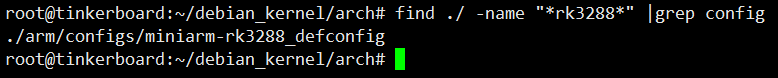

遍历所有分支，有些分支没有这个配置，这可怎么办？

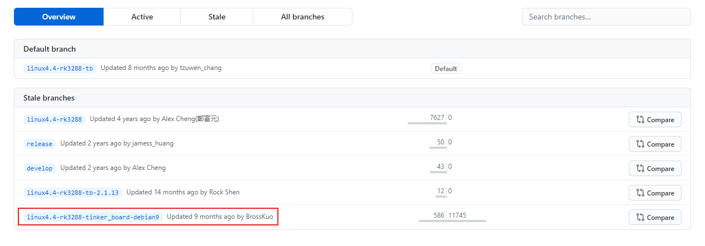

这个分支编译后居然启动不起来，尴尬了。。。好奇的问问是否测试过~~~

最后选了默认分支，也就是 ```linux4.4-rk3288-tb```


## 配置并编译

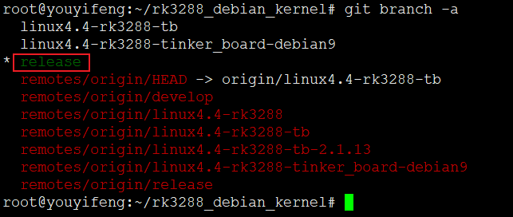

暂时建议使用linux4.4-rk3288-tb分支

```
git checkout linux4.4-rk3288-tb
```

直接编译：

```
#!/bin/bash

set -e

# make mrproper

make ARCH=arm miniarm-rk3288_defconfig -j4
make zImage ARCH=arm  -j4
make modules ARCH=arm  -j4
make ARCH=arm rk3288-miniarm.dtb  -j4

echo "All done! all ok!"
```


交叉编译：

```
#!/bin/bash

set -e

# make mrproper

export ARCH=arm
export CROSS_COMPILE=/usr/bin/arm-linux-gnueabi-
export CROSS32CC=arm-linux-gnueabi-gcc

make ARCH=arm miniarm-rk3288_defconfig -j16
make zImage ARCH=arm CROSS_COMPILE=arm-linux-gnueabi- -j16
make modules ARCH=arm CROSS_COMPILE=arm-linux-gnueabi- -j16
make ARCH=arm rk3288-miniarm.dtb CROSS_COMPILE=arm-linux-gnueabi- -j16
echo "All done! all ok!"
```


放到板子，编译大概20分钟左右（板子散热不行啊，可以烧烤了耶~~）

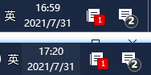


## 编译错误

1. mmp的else语法

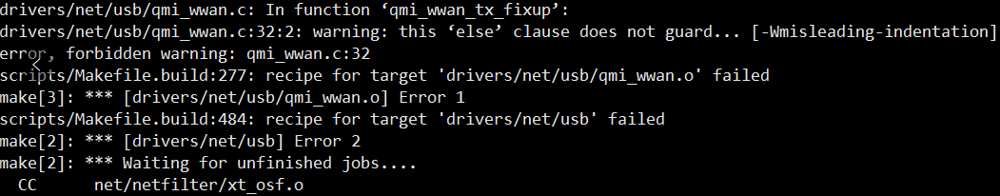

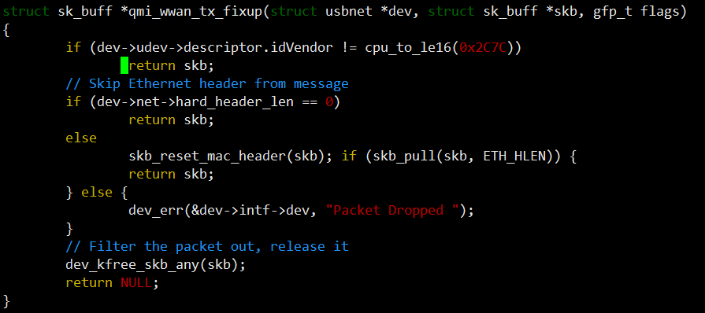

这个mmp的else写的真是骚...

稍微调整一下

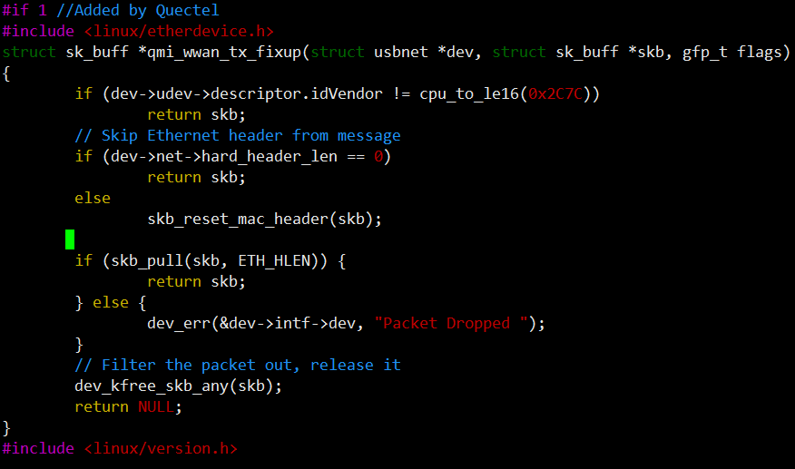


2. 编译成功，但是无法正常启动

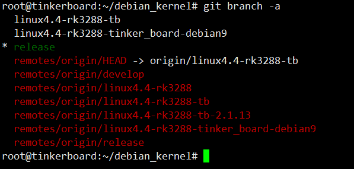


## 安装

1. 安装内核

编译会生成zImage

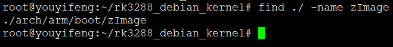

拷贝内核到/boot目录下

```
find ./ -name zImage | xargs -i cp {} /boot/zImage -a
```

2. 安装核外驱动

```
#!/bin/bash

set -e

# make mrproper

#make ARCH=arm miniarm-rk3288_defconfig -j4
#make zImage ARCH=arm  -j4
#make modules ARCH=arm  -j4
#make ARCH=arm rk3288-miniarm.dtb  -j4

if [ ! -d `pwd`/rootfs ];then
	mkdir `pwd`/rootfs -p
else
	rm -rf `pwd`/rootfs
fi

make ARCH=arm INSTALL_MOD_PATH=`pwd`/rootfs modules_install
find ./ -name zImage |xargs -i cp {} `pwd`/rootfs

echo "All done! all ok!"
```

```
root@tb:~/debian_kernel.git# ./2.module.sh
  INSTALL crypto/echainiv.ko
  INSTALL drivers/i2c/i2c-stub.ko
  INSTALL drivers/net/wireless/rockchip_wlan/rtl8723bs/8723bs.ko
  INSTALL drivers/net/wireless/rockchip_wlan/rtl8812AU_8821AU_linux/rtl8812au.ko
  INSTALL drivers/net/wireless/rockchip_wlan/rtl8814au/rtl8814au.ko
  INSTALL drivers/rtc/rtc-ds1307.ko
  INSTALL fs/nfs/flexfilelayout/nfs_layout_flexfiles.ko
  INSTALL net/ipv4/netfilter/nft_reject_ipv4.ko
  INSTALL net/ipv6/netfilter/nft_reject_ipv6.ko
  INSTALL net/netfilter/nft_compat.ko
  INSTALL net/netfilter/nft_counter.ko
  INSTALL net/netfilter/nft_ct.ko
  INSTALL net/netfilter/nft_exthdr.ko
  INSTALL net/netfilter/nft_hash.ko
  INSTALL net/netfilter/nft_limit.ko
  INSTALL net/netfilter/nft_log.ko
  INSTALL net/netfilter/nft_masq.ko
  INSTALL net/netfilter/nft_meta.ko
  INSTALL net/netfilter/nft_queue.ko
  INSTALL net/netfilter/nft_rbtree.ko
  INSTALL net/netfilter/nft_redir.ko
  INSTALL net/netfilter/nft_reject.ko
  INSTALL net/netfilter/nft_reject_inet.ko
  INSTALL net/netfilter/xt_set.ko
  INSTALL sound/drivers/snd-aloop.ko
  INSTALL sound/drivers/snd-dummy.ko
  INSTALL sound/soc/codecs/snd-soc-cs42xx8-i2c.ko
  INSTALL sound/soc/codecs/snd-soc-cs42xx8.ko
  INSTALL sound/soc/rockchip/snd-soc-audioinjector-octo-soundcard.ko
  DEPMOD  4.4.132-nicyou-20210801+
All done! all ok!
```


## 修改内核版本号

内核目录添加localversion文件，编译时候会自动读取
当然也可以添加环境变量

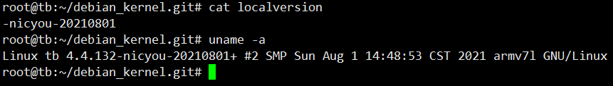


## 参考

* <https://gist.github.com/TinkerTeam/6286550ce70d34f6b3d483cd803da786>


---
